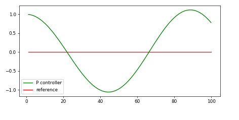
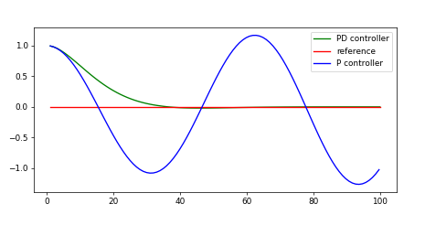

# PID-Controller
This software implements a PID controller in C++ to maneuver a vehicle around a track in a simulator. The simulator will provide the cross track error (CTE) and the velocity (mph) in order to compute the appropriate steering angles.

  

---

## Fundamentals

A large number of different controllers exist to move robots and vehicles. The most fundamental is called PID (Proportional-Integral-Differential). It enables complex, changing accelerations and steering angles. The PID controller is an algorithm that calculates a value (for example a steering wheel angle) according to an error called CTE (see next section for an explanation).

PID is a controller with three coefficients. But first, let's have a look on two important terms before explaining the three components.

### Cross Track Error (CTE)
 * distance between the vehicle´s actual trajectory and the intended trajectory
 
### Systematic Bias
* Systematic bias is a problem that often occurs in robotics. The problem is due to mechanics. Buying for example a vehicle, we think the steerable front wheels are 100% aligned. But in reality the wheels can be aligned a little bit at an angle. The systematic bias manifests itself in a steering drift. For humans this is not a big deal because we just countersteer intuitionally but in robotics this is a fact to be considered. 
 
### P-Controller 
* sets the steering angle in proportion to CTE (the coefficient tau_p is called "response strength"):

`steering angle = -tau_p * cte`

* steers the vehicle towards the trajectory
* using only P-Controller leads to overshooting and oscillating which is demonstrated in the following graph:

  

### PD- Controller 
* steering angle is not just proportional to CTE but also to the time derivative of CTE:

`steering angle = -tau_p * cte - tau_d * diff_cte`

* the derivative component countersteers the vehicle and helps not to overshoot the trajectoy and not to oscillate
* The following graph demonstrates the behaviour of P- and PD-controller combined:

  

### PID-Controller
* this controller finally solves the problem of **overshooting** and **systematic bias** by adding one more term. Using a PID-Controller the steering angle is additionally proportional to the integral of CTE. It considers the systematic error and compensates it.

`steering angle = -tau_p * cte - tau_d * diff_cte - tau_i * int_cte`

  

Now it seems like PID is doing worse than PD but this is only because the graphs above assumed an ideal robot with no bias. 

### Twiddle PID-Controller
Below you can see the corresponding P-, PD-  and PID-graphs using a robot with systematic bias. Now you can see that with a real robot with bias the PD-controller is actually not doing better than the PID-Controller.

  

The dashed line is the goal PID-Controller. We achieve this with a so-called twiddle PID controller (green line) with tuned parameters.
Now the PID controller outshines the PD controller. Also, with twiddle the PID controller converges faster but we overshoot drastically at first. This overshoot can be reduced by tuning the twiddle parameters.

## Implementation and Tuning coefficients
Manual tuning of PID coefficients for steering values.
Please refer to the code lines 40 to 46 in [main.cpp](src/main.cpp) to see the different, tested values for the PID coefficients and retrace the approach to good values. In the following you can see what it would look like to drive with only P- or PD-Controller and the final result with a PID controller.

### P-Controller
The vehicle drives along the trajectory with oscillations:

  

### PD-Controller
The vehicle follows the trajectory with relatively low oscillations:

  

### PID-Controller 
The vehicle follows the trajectory quite well.

  

Due to overspeeding it shakes while taking turns. You can see this in the full clip on YouTube in which the car is driving a whole round: https://www.youtube.com/watch?v=1uSolAqVdQ0
